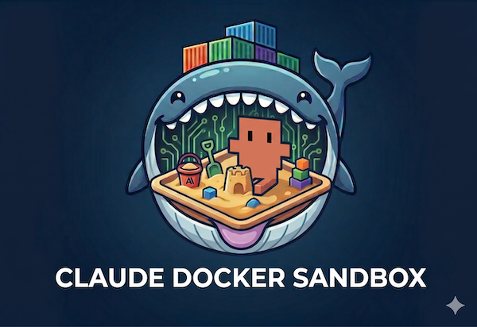

<p align="center">
  
</p>

# Claude Code Sandbox _FOR LINUX_

A Docker-based sandbox for running the [Claude Code](https://docs.claude.com/en/docs/claude-code/overview) CLI with local filesystem isolation. The container sees only a designated workspace directory and its own persistent state — the host's home directory, `/etc`, and everything else on the host remain invisible to the agent.

The image is a batteries-included dev environment, so `pip install`, `cargo install`, and `sudo apt install` work without network delay on launch.

# Features
Look, this uses a heavy docker image, and it's suited to my (Jonn's) needs.  Nevertheless you may find it useful.

Beyond the normal setup and build features, this sandbox has:
- Automated email notifications for prompts that take longer than <CONFIGURABLE> seconds to complete (default 120)
- A built-in, pre-configured [headroom](https://github.com/chopratejas/headroom) installation (runtime-disable-able)
- A built-in [fiss-mcp](https://github.com/broadinstitute/fiss-mcp) server for interacting with Terra. The server runs on the **host**, not inside the container, so the sandbox has no `gcloud` / `gsutil` / `google-cloud-*` libs and no `~/.config/gcloud` mount — the only path from inside the sandbox to Terra/GCP is the MCP tools the server exposes. Read-only by default; opt-in write mode via `FISS_MCP_ALLOW_WRITES=1`, which prints a loud red ASCII-art banner on the host **and** inside the container so it is impossible to miss (banner is pre-rendered, no `figlet` dependency).
- A built-in [CodeGraph](https://github.com/colbymchenry/codegraph) MCP server (stdio, in-container) that gives the agent a pre-indexed tree-sitter code graph — `codegraph_search`, `codegraph_callers`, `codegraph_callees`, `codegraph_impact`, etc. — instead of grep+Read chains. Maintainer benchmarks claim ~58% fewer tool calls and ~16% cheaper turns (directional, single-author). Index is auto-built on first session per workdir via a SessionStart hook and kept current by an in-process file watcher. Disable per-launch with `CODEGRAPH=0`.
- The [caveman](https://github.com/JuliusBrussee/caveman) compression plugin enabled by default at intensity `full` (tracked via `.caveman-active`). Override per session with `/caveman lite|full|ultra` or `stop caveman`.
- An interactive launcher (`start_sandbox.sh`) that lets you pick instance, resume an existing Claude session, and choose a workdir from an fzf menu, instead of hand-sourcing `env.<INSTANCE>.sh` and running `run_claude_docker.sh` directly.

I've tried to include everything I need for my typical work.

This is still Linux only.  Mac build might be coming soon.

## Quick start (fresh clone)

```bash
# 1. Install host prerequisites (sysbox runtime, postfix mynetworks,
#    fiss-mcp host venv).
./setup_host.sh

# 2. Build the image
# NOTE: This step takes ~2200s or 36 minutes.
cd docker && make && cd ..

# 3. Launch the default "main" shared-mode instance.
#    env.example.sh defaults to in-repo workspace/ + context_reference/.
source env.example.sh
./run_claude_docker.sh
```

First launch in any sandbox prompts `/login` inside the container. The resulting OAuth token persists into that sandbox's state dir (`claude-sandbox-shared/.claude/.credentials.json` in shared mode, `claude-sandbox-persistent-state-<INSTANCE>/.claude/.credentials.json` in per-instance mode), so subsequent launches of the same sandbox skip the login. No host-side Claude Code install is required, and credentials are not shared with the host's `~/.claude/`.

### Interactive launcher (alternative to step 4)

`start_sandbox.sh` opens an fzf menu: pick instance, optionally resume an existing Claude session, pick a workdir, launch. It seeds workdir candidates from any `env.*.sh` plus every workdir you've previously picked (master registry at `workdirs.txt`). Sessions are annotated with their host workdir in the picker so you can tell two `main` sessions apart by what they were operating on.

```bash
./start_sandbox.sh
```

### Multi-instance mode

For a second concurrent instance, copy the template and change the instance name:

```bash
cp env.example.sh env.B.sh
$EDITOR env.B.sh   # set CLAUDE_SANDBOX_INSTANCE=B (and PROJECTS_DIR if different)
source env.B.sh && ./run_claude_docker.sh
```

`env.*.sh` (other than `env.example.sh`) is gitignored — your per-instance files won't accidentally land in commits.

For details on per-instance vs shared layouts and parallel launches, see [Mounts](#mounts).

## What's in the image

Base: `node:22-slim`.

- **Claude Code CLI** — `claude`, installed globally via npm.
- **Python 3** — venv at `/opt/claude-venv` (on `PATH`, writable by the sandbox user), preloaded with: `numpy`, `pandas`, `matplotlib`, `scipy`, `scikit-learn`, `seaborn`, `ipython`, `jupyter`, `requests`, `headroom-ai[proxy]`.
- **Rust** — stable toolchain (`rustc`, `cargo`, `rustup`) at `/usr/local/{cargo,rustup}`.
- **Java 17** — Eclipse Temurin JDK at `/opt/java/openjdk`, `JAVA_HOME` exported.
- **CodeGraph** — `codegraph` binary (self-contained bundle, vendored Node runtime) at `/usr/local/bin/codegraph` → `/opt/codegraph/current/bin/codegraph`. Version pinned via `CODEGRAPH_VERSION` in `docker/Dockerfile`; bump + `make rebuild` to refresh.
- **Dev tooling** — `git`, `curl`, `ripgrep`, `vim`, `build-essential`.
- **Passwordless `sudo`** for the container's `claude` user. UID/GID are remapped at container start to match the host invoker (`HOST_UID` / `HOST_GID` env vars supplied by `run_claude_docker.sh`), so a single image is shareable across hosts with different user IDs — no rebuild needed.

Approximate image size: ~3 GB.

## Prerequisites

- Docker 28.x. Docker 29.x is **not** compatible with sysbox-runc —
  containers fail with `namespace {"time" ""} does not exist`
  ([sysbox#1011](https://github.com/nestybox/sysbox/issues/1011),
  open as of 2026-06, no upstream fix). `setup_host.sh` pins docker-ce
  to the newest 5:28.* in the Docker apt repo and holds it.
- **Supported host OS** — `setup_host.sh` requires Docker's apt repo
  to ship a 28.x build for the host's release suite. Verified per Ubuntu LTS:

  | Ubuntu release | suite | docker-ce 28.x in repo? | Notes |
  |---|---|---|---|
  | 22.04 LTS | jammy | yes | works |
  | 24.04 LTS | noble | yes | works, sysbox-supported |
  | 24.10 | oracular | yes | works |
  | 25.04 | plucky | yes | works |
  | 25.10 | questing | yes | works |
  | **26.04 LTS** | **resolute** | **no** | **not supported** — Docker ships 29.x only AND sysbox-ce's distro-compat list does not include 26.04. `setup_host.sh` will exit with the "no docker-ce 28.x" error. Use a 24.04 LTS or 22.04 LTS host for now, or pull the 28.x `.deb` from the `noble` pool by hand (unsupported workaround). |

  Debian 10/11, Fedora 34-37, Rocky 8, Alma 8/9, CentOS Stream, Amazon
  Linux 2/2023 are sysbox-supported per upstream — `setup_host.sh` itself
  only knows the Debian/Ubuntu apt path, so other distros need an adapted
  setup script.

- No host-side Claude Code install required. Each sandbox prompts `/login` on its own first launch and stores the resulting OAuth token inside its own state dir (`claude-sandbox-shared/.claude/.credentials.json` in shared mode, `claude-sandbox-persistent-state-<INSTANCE>/.claude/.credentials.json` in per-instance mode). The host's `~/.claude/` is NOT mounted into the container.

## Build

```bash
cd docker
make             # cache-friendly build — use 99% of the time
make rebuild     # forced: --no-cache + --pull base image
make clean       # drop the local tags so the next `build` starts clean
```

Tags the image as `claude-sandbox:0.0.1` and `claude-sandbox:latest`. First build pulls the Temurin JDK image, the Rust toolchain, and a few hundred MB of Python wheels — expect several minutes.

Use `make rebuild` when you need a newer Claude Code from npm (the `RUN npm install -g @anthropic-ai/claude-code` layer is unpinned, so cache-friendly builds will not re-fetch it), when bumping `CODEGRAPH_VERSION` in the Dockerfile, when base-image security updates need to land, or when the cache feels stale.

## Run

The launcher script (`run_claude_docker.sh`) forwards any arguments to `claude` inside the container:

```bash
./run_claude_docker.sh                                     # fresh session
./run_claude_docker.sh --continue                          # resume most recent
./run_claude_docker.sh --resume <session-id>               # resume specific
./run_claude_docker.sh --dangerously-skip-permissions      # no prompts
./run_claude_docker.sh --continue --dangerously-skip-permissions
```

To drop into a shell instead of `claude`, change the trailing `claude "$@"` in `run_claude_docker.sh` to `/bin/bash`.

## Headroom proxy (token compression)

The image bundles [Headroom](https://github.com/chopratejas/headroom), a local HTTP proxy that compresses prompts, tool outputs, and history before forwarding to the Claude API. Off by default. Toggle per launch:

```bash
HEADROOM=1 ./run_claude_docker.sh                  # on
./run_claude_docker.sh                             # off
HEADROOM=1 ./run_claude_docker.sh --continue       # on + resume
HEADROOM_PORT=9000 HEADROOM=1 ./run_claude_docker.sh   # custom port
```

How it works: when `HEADROOM=1`, `start_script.sh` launches `headroom proxy` on `127.0.0.1:$HEADROOM_PORT` (default 8787) and exports `ANTHROPIC_BASE_URL` so `claude` routes through it. The proxy applies AST-aware code compression, JSON-output stripping, prompt-cache prefix alignment, and recovery-on-demand for dropped messages, then forwards to `api.anthropic.com` using the existing OAuth token. Process dies with the container; nothing persists across runs. Stats: `curl http://127.0.0.1:8787/stats` from inside the container.

Trust model: the proxy reads every byte of every request — that's how compression works. It runs entirely inside the same container as `claude`, so it sees the same OAuth token Claude already has and no wider trust boundary is opened. Code is Apache-2.0; pin the version in `Dockerfile`. If you don't want a third-party dep in the request path, leave `HEADROOM` unset and traffic goes direct.

Per-instance default: add `export HEADROOM=1` to the matching `env.<INSTANCE>.sh` to make it sticky for that sandbox.

## CodeGraph MCP (in-container, stdio)

The image bakes the [CodeGraph](https://github.com/colbymchenry/codegraph) bundle into `/opt/codegraph` and symlinks `codegraph` onto `PATH`. Pinned via `ENV CODEGRAPH_VERSION=v0.9.9` in `docker/Dockerfile` — bump that line and `make rebuild` to land a newer release. The bundle ships its own Node runtime, so there is no Node/npm dependency at runtime.

On every container boot, `start_script.sh` registers `mcpServers.codegraph` in `~/.claude.json` (same idempotent jq pattern as fiss-mcp). Claude Code then spawns `codegraph serve --mcp` as a stdio subprocess per session; the subprocess dies with `claude`, so there is no orphan daemon. A file watcher inside the MCP server (inotify, 2 s debounce) keeps the SQLite index live as files change.

Auto-index per workdir: the SessionStart hook `claude-sandbox-shared/.claude/hooks/codegraph-init.sh` detached-spawns `codegraph init -i` when `/workspace` is a git repo **and** `/workspace/.codegraph/codegraph.db` is missing. Indexing runs in the background; the prompt does not block on it. MCP queries during the initial index return partial results. Subsequent sessions in the same workdir reuse the existing index, and the live watcher handles incremental updates. Skip indexing for a specific workdir by `touch /workspace/.codegraph-disable`.

```bash
./run_claude_docker.sh             # codegraph on (default)
CODEGRAPH=0 ./run_claude_docker.sh # disable MCP registration this launch
```

The agent gets MCP tools `codegraph_search`, `codegraph_callers`, `codegraph_callees`, `codegraph_impact`, `codegraph_explore`, `codegraph_node`, `codegraph_files`, and `codegraph_status` — designed to replace grep+Read chains for symbol lookup and call-tree navigation. The index lives in `/workspace/.codegraph/` so it persists across container restarts via the workdir bind mount. Add `.codegraph/` to your per-repo `.gitignore` so the SQLite file does not land in commits.

Resource cost: ~50 MB image bundle; idle MCP server ~80-150 MB RSS while a session is open; ~1-10 MB SQLite DB per 100k LOC; CPU spike only on file change. Initial index of a fresh medium-sized repo is seconds to a couple of minutes.

## fiss-mcp (Terra MCP server) — runs on the host

The launcher spawns [fiss-mcp](https://github.com/broadinstitute/fiss-mcp) as a host-side HTTP MCP server before starting the container, then advertises its URL to the container via `FISS_MCP_URL`. The in-container `start_script.sh` registers an HTTP MCP entry in `~/.claude.json` pointing at `http://host.docker.internal:<PORT>/mcp/`. When `run_claude_docker.sh` exits (or you ^C it), a bash `EXIT` trap kills the host process.

**Why host-side**: the container never sees `gcloud`, `gsutil`, `google-cloud-*` libs, `~/.config/gcloud`, or any service-account key file. The agent's only reachable path to Terra/GCP is the MCP tools the host server exposes — which are read-only by default. There is no shell-level bypass.

**Install**: `setup_host.sh` runs `host_fiss_mcp/install.sh` once. It clones fiss-mcp into `host_fiss_mcp/fiss-mcp/` (next to the script in this repo) and creates a venv at `host_fiss_mcp/venv/` — both gitignored — so everything is self-contained inside the checkout and isolated from any other Python install on the host. Requires Python 3.10+ on the host (apt-installed by `setup_host.sh` if missing). If you launch `run_claude_docker.sh` with `FISS_MCP=1` and the install dir is absent, the run script errors out and tells you to run `./setup_host.sh`.

The installer pins fiss-mcp to a specific release tag **and** verifies the resolved commit SHA against a recorded value. If the upstream tag has been moved, the install aborts rather than silently building a different version. A marker file in the venv encodes the pinned ref + SHA; a re-install runs automatically the next time you bump either constant in `host_fiss_mcp/install.sh`.

**Auth**: the host server inherits the host's gcloud credentials directly — no mount, no env var forwarding. Set up once on the host:

```bash
gcloud auth login                              # user creds (the Terra-registered identity)
gcloud auth application-default login          # ADC (FISS uses this)
```

On a GCE VM with a default service account, the metadata server is picked up automatically — but Terra is user-identity-based, so a workspace-registered Google account is generally required.

**Toggle and write-access:**

```bash
./run_claude_docker.sh                            # fiss-mcp on, read-only (default)
FISS_MCP=0 ./run_claude_docker.sh                 # off (no spawn, no registration)
FISS_MCP_ALLOW_WRITES=1 ./run_claude_docker.sh    # on, WRITE MODE (loud banner)
```

> **Warning**: `FISS_MCP_ALLOW_WRITES=1` lets the agent submit workflows, mutate workspace attributes, and spend money on your Terra/GCP account. Both `run_claude_docker.sh` and `start_script.sh` print a red ASCII-art banner (pre-rendered figlet output, no host or image dependency) when write mode is on, on the host and inside the container respectively, so the warning shows up no matter where you're reading the terminal.

**Ports**: each instance gets a deterministic port in `39000-39999` hashed from `CLAUDE_SANDBOX_INSTANCE`, so concurrent sandboxes don't collide. Override with `FISS_MCP_PORT=<port>` if the auto-pick clashes with something else on the host.

**Container connectivity**: `run_claude_docker.sh` adds `--add-host=host.docker.internal:host-gateway` so the container can reach the host on a stable name. Works with `sysbox-runc` because it's a Docker daemon flag, not a runtime concern.

**Bind address**: the host server binds **only** the docker bridge gateway IP (auto-detected via `docker network inspect bridge`), not `0.0.0.0` and not `127.0.0.1`. That's the same address the container reaches us at via `host.docker.internal`, so container ingress is unchanged — but the listener is not present on `eth0` / `wlan0` / any external interface, so no iptables fence is required to keep it off the host's outside-world network. If the bridge gateway can't be determined (broken docker setup), the launcher fails fast rather than silently widening the bind to `0.0.0.0`.

**Lifecycle**: trap on `EXIT INT TERM` kills the host fastmcp process. If the launcher is `kill -9`'d, the orphan can be reaped with `pkill -f run-server.py`. The MCP log lives at `${SANDBOX_HOME}/.claude/host_fiss_mcp.log`.

Per-instance default: set `FISS_MCP` / `FISS_MCP_ALLOW_WRITES` / `FISS_MCP_PORT` in `env.<INSTANCE>.sh`.

## Vertex AI mode (Google Cloud auth)

The sandbox can route `claude` traffic through [Google Vertex AI](https://cloud.google.com/vertex-ai/generative-ai/docs/partner-models/use-claude) instead of the default Anthropic API. Same security pattern as fiss-mcp: the gcloud-shaped pieces (access-token mint, GCP service-account or ADC creds) stay on the **host** — the container has no `gcloud`, no `google-cloud-*` libs, and no `~/.config/gcloud` mount. A small host-side script (`vertex_proxy.py`) accepts Anthropic-shape POST bodies, strips the incoming Authorization header, signs with a fresh `gcloud auth print-access-token`, and forwards to Vertex.

**Architecture (Option B — chained, compression-compatible):**

```
claude (Anthropic mode, in container)
   └─ ANTHROPIC_BASE_URL = headroom (when HEADROOM=1) or vertex_proxy (when HEADROOM=0)
        └─ headroom (in container, optional)
             └─ ANTHROPIC_TARGET_API_URL = vertex_proxy URL
                  └─ vertex_proxy.py (on host, gcloud token mint)
                       └─ Vertex AI
```

`claude` does **NOT** run in Vertex SDK mode. It stays in standard Anthropic mode, sending Anthropic-shape POST bodies. Vertex's `:rawPredict` endpoint accepts the Anthropic Messages body format unchanged, so no body translation is needed at any hop. The host proxy replaces the auth header — compression and routing stay orthogonal.

**Activate**: copy the template, edit your project id, source it, launch:

```bash
cp SET_VERTEX_MODE.example.sh SET_VERTEX_MODE.sh
$EDITOR SET_VERTEX_MODE.sh           # set ANTHROPIC_VERTEX_PROJECT_ID and CLOUD_ML_REGION
source SET_VERTEX_MODE.sh
./run_claude_docker.sh               # optionally HEADROOM=1 for compression
```

`SET_VERTEX_MODE.sh` is gitignored — your real project id won't accidentally land in a commit. To go back to default Anthropic-API (subscription) mode, `source UNSET_VERTEX_MODE.sh` (or open a fresh shell).

**Toggle**: per-launch, not mid-session. claude reads env at startup. Different `env.<INSTANCE>.sh` files can pin different modes (one sandbox always Vertex, another always subscription).

| HEADROOM | USE_VERTEX | Flow |
|---|---|---|
| 0 | 0 | claude → api.anthropic.com (OAuth, no compression) |
| 1 | 0 | claude → headroom → api.anthropic.com (OAuth + compression) |
| 0 | 1 | claude → vertex_proxy → Vertex (gcloud token, no compression) |
| 1 | 1 | claude → headroom → vertex_proxy → Vertex (gcloud token + compression) |

**Requires gcloud on the host**: the proxy mints OAuth tokens via `gcloud auth print-access-token`. `setup_host.sh` checks for `gcloud` on `PATH` at install time and prints a warning if missing — it does **not** install gcloud automatically (picking a distribution channel is a host-policy decision). On a workstation, install the SDK from your distro or [Google's instructions](https://cloud.google.com/sdk/docs/install), then:

```bash
gcloud auth login
gcloud auth application-default login
```

The launcher refuses to start in Vertex mode if `gcloud` isn't on `PATH`, or if `ANTHROPIC_VERTEX_PROJECT_ID` / `CLOUD_ML_REGION` are unset.

**How the container is wired**: when `CLAUDE_CODE_USE_VERTEX=1` is present in the launching shell, `run_claude_docker.sh`:

1. Spawns `vertex_proxy.py` bound only to the docker bridge gateway IP, on a per-instance hashed port in `38000-38999` (disjoint from fiss-mcp's 39xxx range).
2. Waits for it to come up, registers a trap on `EXIT INT TERM` so the proxy dies with the launcher.
3. Forwards `ANTHROPIC_TARGET_API_URL=http://host.docker.internal:<port>` into the container — that env var is read by **headroom** (`--backend anthropic` mode, the default) and overrides its upstream from `api.anthropic.com` to the host proxy.
4. Also forwards `ANTHROPIC_MODEL` and `CLAUDE_CODE_EXPERIMENTAL_AGENT_TEAMS` (orthogonal to Vertex). Does **not** forward `CLAUDE_CODE_USE_VERTEX` itself — that's a launcher-side signal only.

When HEADROOM=0, `start_script.sh` instead sets `ANTHROPIC_BASE_URL=$ANTHROPIC_TARGET_API_URL` so `claude` bypasses the (absent) headroom and hits the host proxy directly.

**Bind address**: same model as fiss-mcp — bridge gateway IP only, never `0.0.0.0`. Launcher fails fast if the bridge IP can't be determined.

**Port override**: `VERTEX_PROXY_PORT=<port>` on the launcher line picks a specific port if the auto-pick clashes.

**Log**: `${SANDBOX_HOME}/.claude/host_vertex_proxy.log`. Tail this when debugging auth failures or upstream Vertex errors.

**fiss-mcp and Vertex are orthogonal** — you can run both simultaneously (separate processes, separate port ranges, separate trap cleanups) or either alone.

Per-instance default: add `source SET_VERTEX_MODE.sh` at the top of `env.<INSTANCE>.sh` if you want a specific sandbox to always run in Vertex mode.

## Mounts

Two layout modes, picked per launch by `CLAUDE_SANDBOX_USE_SHARED`:

- **Per-instance (`=0` or unset)** — full Claude state lives in `$SANDBOX_HOME/.claude` for this one instance. Instances are fully independent. No shared dir touched.
- **Shared (`=1`)** — settings/skills/plugins/hooks/plans/tasks/sessions come from `$SHARED_HOME` (one copy across all shared-mode instances). `.claude.json` plus write-hot dirs (cache, file-history, backups, shell-snapshots, session-env, projects, history.jsonl) stay in `$SANDBOX_HOME` and bind-mount on top of the shared `.claude`. `.claude.json` and `projects/` are per-instance because they're rewritten on every change and hold per-project allowedTools/mcpServers/history/transcripts that would race if shared.

The example envs (`env.example.sh`, `env.B.sh`, `env.WHB.sh`, `env.GATK.sh`, `env.main.sh`) all set `CLAUDE_SANDBOX_USE_SHARED=1` — shared is the de-facto default on this checkout. The code-level fallback (when neither set nor sourced) is per-instance.

### Per-instance mode (default)

| Host path | Container path | Purpose |
|---|---|---|
| `$PROJECTS_DIR` | `/workspace` | Read/write workspace. CWD on launch. |
| `$SANDBOX_HOME/.claude/` | `/home/claude/.claude` | All Claude state (settings, memory, sessions, plugins, caches, **OAuth token**). |
| `$SANDBOX_HOME/.claude.json` | `/home/claude/.claude.json` | Onboarding state, project history. |

The host's `~/.claude/` is NOT mounted. The OAuth token from `/login` lands at `$SANDBOX_HOME/.claude/.credentials.json` (inside the directory mount above) and stays scoped to this sandbox.

(fiss-mcp / Terra creds are **not** mounted — the MCP server runs on the host. See [fiss-mcp section](#fiss-mcp-terra-mcp-server--runs-on-the-host).)

### Shared mode (opt-in)

| Host path | Container path | Scope |
|---|---|---|
| `$PROJECTS_DIR` | `/workspace` | per-instance (caller-supplied) |
| `$SHARED_HOME/.claude/` | `/home/claude/.claude` | shared — settings, skills, plugins, hooks, projects, plans, tasks, sessions |
| `$SANDBOX_HOME/.claude.json` | `/home/claude/.claude.json` | per-instance — onboarding state, per-project allowedTools/mcpServers/history. Rewritten whole on every change, would race if shared. |
| `$SANDBOX_HOME/.claude/cache` | `/home/claude/.claude/cache` | per-instance |
| `$SANDBOX_HOME/.claude/file-history` | `/home/claude/.claude/file-history` | per-instance |
| `$SANDBOX_HOME/.claude/backups` | `/home/claude/.claude/backups` | per-instance |
| `$SANDBOX_HOME/.claude/shell-snapshots` | `/home/claude/.claude/shell-snapshots` | per-instance |
| `$SANDBOX_HOME/.claude/session-env` | `/home/claude/.claude/session-env` | per-instance |
| `$SANDBOX_HOME/.claude/projects` | `/home/claude/.claude/projects` | per-instance — Claude session transcripts (one jsonl per session, plus `.workdir` sidecar files written by `start_sandbox.sh` so the picker can show which host workdir each session ran against) |
| `$SANDBOX_HOME/.claude/history.jsonl` | `/home/claude/.claude/history.jsonl` | per-instance |

The OAuth token from `/login` lands inside the shared `.claude/` (at `$SHARED_HOME/.claude/.credentials.json`) and is therefore shared across every shared-mode sandbox on this host — log in once, every shared-mode instance reuses the token. The host's `~/.claude/` is NOT mounted.

`$SHARED_HOME` defaults to `claude-sandbox-shared/` next to `run_claude_docker.sh` (override: `CLAUDE_SANDBOX_SHARED`). `$SANDBOX_HOME` defaults to `claude-sandbox-persistent-state-${CLAUDE_SANDBOX_INSTANCE}/` (override: `CLAUDE_SANDBOX_HOME`). Both must be absolute paths.

Nothing else on the host is visible to the container.

### Adopting shared mode safely (no risk to existing instances)

Opt a sandbox into shared mode by adding `export CLAUDE_SANDBOX_USE_SHARED=1` to its `env.<INSTANCE>.sh` (the bundled `env.*.sh` files already do this). First launch on a fresh clone uses the tracked `claude-sandbox-shared/.claude/` (CLAUDE.md, settings.json, hooks, skills, caveman defaults) directly; subsequent launches reuse it. Switch back to per-instance any time by removing that line — `run_claude_docker.sh` will seed a copy of the tracked settings + hooks into the per-instance dir on first launch (`seed_settings` / `seed_hooks`).

### Concurrency caveats (shared mode)

Hot dirs are per-instance — no race. Shared items are write-rare in practice, but two shared-mode instances writing the same file at the same time can interleave or last-write-wins:

- **Sessions**: each session is its own file (`sessions/<id>.json`). Two instances using the same session id concurrently would corrupt it. Sessions are uuid-named so practical overlap is near zero.
- **Plugin install/upgrade**: if you install a plugin in one instance while another reads `installed_plugins.json`, restart the second to pick it up cleanly.
- **Memory (`projects/`)**: per-file atomic writes; rare contention.

## Read-only reference mounts

Optional caller-supplied read-only bind mounts for reference datasets, shared corpora, system config — anything the agent should be able to read but never mutate. Set `CLAUDE_SANDBOX_RO_MOUNTS` in your `env.<INSTANCE>.sh` to a **space-separated list of host directories** (no container path — the launcher picks one):

```bash
export CLAUDE_SANDBOX_RO_MOUNTS="/data/reference /srv/corpus /etc/shared-config"
```

Each entry shows up at `/read-only-reference/<name>` inside the container, where `<name>` is the host basename by default. On basename collision, the launcher prepends parent-dir segments joined by underscores until every name is unique:

| Host paths | Container paths |
|---|---|
| `/data/reference` `/srv/corpus` | `/read-only-reference/reference` `/read-only-reference/corpus` |
| `/a/b/data` `/x/y/data` | `/read-only-reference/b_data` `/read-only-reference/y_data` |
| `/a/x/foo` `/b/x/foo` `/c/x/foo` | `/read-only-reference/a_x_foo` `/read-only-reference/b_x_foo` `/read-only-reference/c_x_foo` |

Each accepted mount prints `ro-mount: <host> -> /read-only-reference/<name>` at launch.

**Validation** (CRITICAL ERROR on failure):
- Absolute paths only.
- Host path must already exist on disk — refuses to launch otherwise so Docker doesn't auto-create the source as a directory (same trap the `check_not_directory` guard protects against on the credentials side).

**Enforcement**: the `:ro` flag sets `MS_RDONLY` on the mount in the container's mount namespace. Every write attempt (`open(O_WRONLY)`, `unlink`, `rename` into the tree) returns `EROFS` at the syscall layer — file permissions and `sudo` don't help because the restriction is at the mount, not the inode. The sandbox does not run `--privileged` and does not grant `CAP_SYS_ADMIN`, so a `mount -o remount,rw` from inside also fails with `EPERM`. Host-side edits to the directory are visible to the container immediately (bind mount shares inodes); that's the operator's intentional channel for updating reference material.

The interactive launcher (`start_sandbox.sh`) shows a one-line `RO mounts` summary in each area's preview pane — count + first three basenames.

## Persistence

- **Per-instance mode** — everything in `$SANDBOX_HOME` (settings + state + sessions + caches), preserved across runs of that instance only.
- **Shared mode** — settings, skills, plugins, hooks, memory, sessions, plans, tasks, onboarding live in `$SHARED_HOME` (visible to all shared-mode instances). Cache, file-history, backups, shell-snapshots, session-env, history.jsonl stay per-instance.
- **Shared with the host**: OAuth credentials (single token refreshed by whichever process needs it first).
- **Ephemeral** (gone on `--rm` container exit): anything written outside the mounts — `pip install`, `cargo install`, `sudo apt install`, files in `/tmp`, etc. If you want these to persist, either rebuild the image with them baked in, or add the relevant directories (e.g. `/opt/claude-venv`, `/usr/local/cargo`) as additional mounts.

## Customization

- **Add Python packages**: extend the `pip install` line in the `Dockerfile` and rebuild. Pin versions there if you want reproducibility (`numpy==1.26.4`, etc.).
- **Add system packages**: extend the `apt-get install` line.
- **Switch Java versions**: change the `FROM eclipse-temurin:17-jdk AS temurin` line to e.g. `21-jdk`.
- **Rust channels**: change `--default-toolchain stable` to `nightly` or a specific version.

## Isolation scope

This sandbox restricts **filesystem access only**. Network access from inside the container is unrestricted — the agent can reach the Claude API, npm, PyPI, crates.io, and the open internet. This is intentional: the goal is to keep the agent out of the host's home directory and system files, not to firewall its tool use. If you need network restrictions too, combine this with `--network none`, a custom Docker network, or the official Claude Code devcontainer's firewall (which is a separate, more restrictive setup).

## Adapting paths for your machine

Paths are driven by environment variables — nothing is hardcoded in `run_claude_docker.sh`. Set these in your `env.<INSTANCE>.sh` (start from `env.example.sh`):

- `CLAUDE_SANDBOX_PROJECTS_DIR` — host dir mounted at `/workspace` (required).
- `CLAUDE_SANDBOX_CONTEXT_DIR` — host dir mounted at `/context` (required).
- `CLAUDE_SANDBOX_INSTANCE` — unique instance name (required; suffixes container, DinD volume, state dir).
- `CLAUDE_SANDBOX_HOME` — override the per-instance state dir (default: `claude-sandbox-persistent-state-<INSTANCE>/` alongside the launcher).
- `CLAUDE_SANDBOX_SHARED` — override the shared dir in shared mode (default: `claude-sandbox-shared/`).

Per-instance overrides also cover `HEADROOM`, `HEADROOM_PORT`, `FISS_MCP`, `FISS_MCP_ALLOW_WRITES`, `FISS_MCP_PORT`, `CODEGRAPH` (set `=0` to skip CodeGraph MCP registration in that sandbox), `CLAUDE_SANDBOX_USE_SHARED`, `CLAUDE_SANDBOX_RO_MOUNTS` (space-separated host directories — no container path; each shows up at `/read-only-reference/<basename>` inside the container, with parent-dir prefixes underscored on collision; host paths must exist or the launcher refuses), and the Vertex-mode launcher signals (`CLAUDE_CODE_USE_VERTEX`, `ANTHROPIC_VERTEX_PROJECT_ID`, `CLOUD_ML_REGION`, `ANTHROPIC_MODEL`, `CLAUDE_CODE_EXPERIMENTAL_AGENT_TEAMS`, `VERTEX_PROXY_PORT`) — set whichever you want sticky for that sandbox.

## License

[PolyForm Shield License 1.0.0](https://polyformproject.org/licenses/shield/1.0.0) — see [LICENSE.md](LICENSE.md). Use, modify, and redistribute freely for any purpose **except** providing a product that competes with this software. Standard fair-use rights are preserved.
